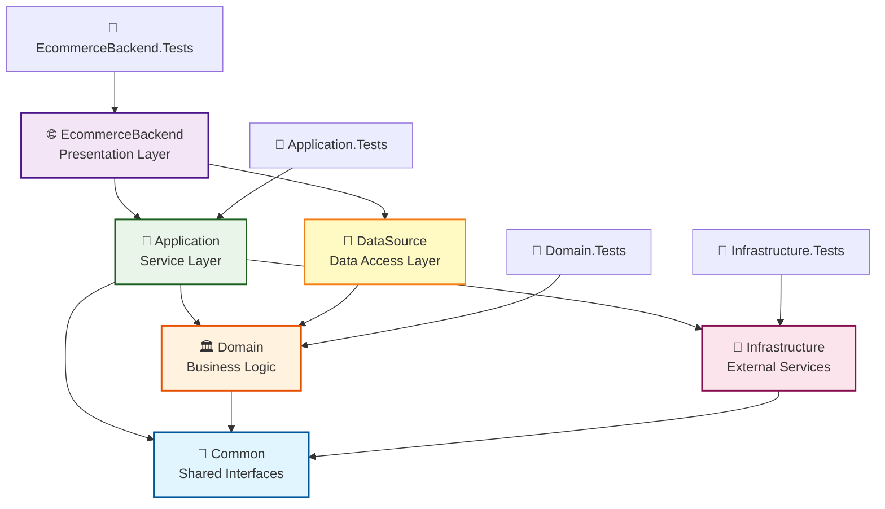

# EcommerceBackend 專案架構介紹

## 📁 專案目錄結構

```
EcommerceBackend/
├── 🌐 EcommerceBackend/           # Web API 層 (Presentation Layer)
│   ├── Controllers/               # API 控制器
│   ├── MiddleWares/              # 中介軟體
│   ├── Models/                   # API 模型
│   ├── Constants/                # 常數定義
│   ├── Filter/                   # 過濾器
│   └── Program.cs                # 程式進入點
│
├── 🔧 Application/                # 應用服務層 (Application Layer)
│   ├── Services/                 # 應用服務實作
│   ├── DTOs/                     # 資料傳輸物件
│   ├── Extensions/               # 擴充方法
│   ├── Interfaces/               # 應用服務介面
│   ├── Oauth/                    # OAuth 相關
│   └── DummyData/                # 測試資料
│
├── 🏛️ Domain/                     # 領域層 (Domain Layer)
│   ├── Entities/                 # 實體類別
│   ├── Services/                 # 領域服務
│   ├── Interfaces/               # 領域介面
│   ├── Enums/                    # 列舉定義
│   └── DomainServiceResult.cs    # 領域服務回應
│
├── 💾 DataSource/                 # 資料存取層 (Data Access Layer)
│   ├── DBContext/                # Entity Framework DbContext
│   ├── Repositories/             # 儲存庫實作
│   └── Migrations/               # 資料庫遷移檔案
│
├── 🔌 Infrastructure/             # 基礎設施層 (Infrastructure Layer)
│   ├── Cache/                    # Redis 快取服務
│   ├── MQ/                       # RabbitMQ 消息佇列
│   ├── Http/                     # HTTP 工具
│   ├── Utils/                    # 工具類別
│   └── Interfaces/               # 基礎設施介面
│
├── 🔗 Common/                     # 共用介面層 (Common Interfaces)
│   └── Interfaces/               # 跨層級共用介面
│       ├── Infrastructure/       # 基礎設施介面
│       └── Application.Services/ # 應用服務介面
│
└── 🧪 Tests/                      # 測試專案群組
    ├── Application.Tests/        # 應用層測試
    ├── Domain.Tests/             # 領域層測試
    ├── Infrastructure.Tests/     # 基礎設施層測試
    └── EcommerceBackend.Tests/   # Web API 層測試
```

## 🏗️ 各層級作用說明

### 1. **Common Layer** 🔗
**作用**: 定義跨層級的共用介面，避免循環依賴

**主要內容**:
- `IRedisService` - Redis 快取服務介面
- `IEncryptionService` - 加密服務介面
- `IOrderTimeoutProducer` - 訂單超時生產者介面
- `IOrderTimeoutConsumer` - 訂單超時消費者介面
- `IOrderTimeoutHandler` - 訂單超時處理介面

**特點**: 
- ✅ 無任何外部依賴
- ✅ 被其他層級依賴
- ✅ 解決循環依賴問題

### 2. **Domain Layer** 🏛️
**作用**: 核心業務邏輯和實體定義，系統的業務核心

**主要內容**:
- **Entities/**: 業務實體 (`User`, `Product`, `Order`, `Cart`, `Payment` 等)
- **Services/**: 領域服務 (`UserDomainService`, `OrderDomainService`, `CartDomainService`)
- **Interfaces/**: 領域介面 (儲存庫介面、領域服務介面)
- **Enums/**: 業務列舉 (`OrderStatus`, `PaymentMethod`, `ShipmentStatus`)

**特點**:
- ✅ 純業務邏輯，無技術依賴
- ✅ 定義業務規則和約束
- ✅ 被上層調用，不依賴具體實作

### 3. **DataSource Layer** 💾
**作用**: 資料庫操作和資料持久化

**主要內容**:
- **DBContext/**: Entity Framework 資料庫上下文
- **Repositories/**: 儲存庫實作 (`UserRepository`, `OrderRepository` 等)
- **Migrations/**: EF Core 資料庫遷移檔案

**技術棧**:
- Entity Framework Core 8.0
- SQLite 資料庫
- Repository 模式

**特點**:
- ✅ 實作 Domain 層定義的儲存庫介面
- ✅ 處理資料持久化邏輯
- ✅ 資料庫無關的抽象

### 4. **Infrastructure Layer** 🔌
**作用**: 外部系統整合和技術服務提供

**主要內容**:
- **Cache/**: Redis 快取服務實作
- **MQ/**: RabbitMQ 消息佇列 (生產者/消費者)
- **Utils/**: 工具類別 (加密、雜湊、文字處理)
- **Http/**: HTTP 工具類別

**技術棧**:
- Redis (StackExchange.Redis)
- RabbitMQ Client 7.0
- BCrypt 加密
- SHA256 雜湊

**特點**:
- ✅ 實作技術相關的基礎設施服務
- ✅ 與外部系統整合
- ✅ 提供跨切面的技術服務

### 5. **Application Layer** 🔧
**作用**: 應用服務和業務流程協調，串接各層級功能

**主要內容**:
- **Services/**: 應用服務 (`UserService`, `OrderService`, `CartService`, `PaymentService`)
- **DTOs/**: 資料傳輸物件
- **Extensions/**: 擴充方法 (實體轉換、DTO 映射)
- **Interfaces/**: 應用服務介面

**特點**:
- ✅ 協調 Domain 和 Infrastructure
- ✅ 實作完整的業務流程
- ✅ 處理事務邊界和異常

### 6. **Presentation Layer (EcommerceBackend)** 🌐
**作用**: Web API 端點和 HTTP 請求處理

**主要內容**:
- **Controllers/**: API 控制器 (`UserController`, `OrderController` 等)
- **MiddleWares/**: 中介軟體 (驗證、日誌記錄)
- **Models/**: API 模型和回應格式
- **Filter/**: 請求過濾器

**技術棧**:
- ASP.NET Core 8.0
- Swagger/OpenAPI
- Serilog 日誌
- JWT 驗證

**特點**:
- ✅ 處理 HTTP 請求和回應
- ✅ API 文檔和驗證
- ✅ 跨領域關注點 (日誌、異常處理)

## 🔄 依賴關係圖



## 📋 專案依賴關係詳細說明

### **向上依賴** (依賴方向: 上層 → 下層)

```
EcommerceBackend → Application + DataSource
Application → Domain + Infrastructure + Common
DataSource → Domain
Domain → Common
Infrastructure → Common
```

### **依賴規則**:
1. ✅ **允許的依賴**: 上層可以依賴下層
2. ❌ **禁止的依賴**: 下層不能依賴上層
3. ✅ **介面依賴**: 透過 Common 層的介面依賴
4. ❌ **循環依賴**: 已通過 Common 層解決

## 🎯 專案檔案依賴關係

### **EcommerceBackend.csproj**
```xml
<ProjectReference Include="..\Application\Application.csproj" />
<ProjectReference Include="..\DataSource\DataSource.csproj" />
```

### **Application.csproj**
```xml
<ProjectReference Include="..\Domain\Domain.csproj" />
<ProjectReference Include="..\Infrastructure\Infrastructure.csproj" />
<ProjectReference Include="..\Common\Common.csproj" />
```

### **DataSource.csproj**
```xml
<ProjectReference Include="..\Domain\Domain.csproj" />
```

### **Domain.csproj**
```xml
<ProjectReference Include="..\Common\Common.csproj" />
```

### **Infrastructure.csproj**
```xml
<ProjectReference Include="..\Common\Common.csproj" />
```

### **Common.csproj**
```xml
<!-- 無專案依賴 -->
```

## 🔧 主要服務和介面

### **應用服務** (Application Layer)
- `IUserService` → `UserService` - 使用者管理
- `IOrderService` → `OrderService` - 訂單處理
- `ICartService` → `CartService` - 購物車管理
- `IProductService` → `ProductService` - 商品管理
- `IPaymentService` → `PaymentService` - 支付處理

### **領域服務** (Domain Layer)
- `IUserDomainService` → `UserDomainService` - 使用者領域邏輯
- `IOrderDomainService` → `OrderDomainService` - 訂單領域邏輯
- `ICartDomainService` → `CartDomainService` - 購物車領域邏輯

### **基礎設施服務** (Infrastructure Layer)
- `IRedisService` → `RedisService` - Redis 快取
- `IEncryptionService` → `EncryptionService` - 加密服務
- `IOrderTimeoutProducer` → `OrderTimeoutProducer` - 訂單超時消息生產
- `IOrderTimeoutConsumer` → `OrderTimeoutConsumer` - 訂單超時消息消費

### **儲存庫** (DataSource Layer)
- `IUserRepository` → `UserRepository` - 使用者資料存取
- `IOrderRepository` → `OrderRepository` - 訂單資料存取
- `ICartRepository` → `CartRepository` - 購物車資料存取
- `IProductRepository` → `ProductRepository` - 商品資料存取

## 📦 主要技術棧

### **後端框架**
- ASP.NET Core 8.0
- Entity Framework Core 8.0

### **資料庫**
- SQLite (開發環境)
- Entity Framework Migrations

### **快取**
- Redis (StackExchange.Redis)

### **消息佇列**
- RabbitMQ Client 7.0
- x-delayed-message 插件

### **測試框架**
- NUnit 3.14
- Moq 4.20.72

### **日誌**
- Serilog.AspNetCore

### **API 文檔**
- Swagger/OpenAPI (Swashbuckle)

## 🎯 架構優勢

### **✅ 優點**
1. **清晰的層級分離** - 每層職責明確，易於維護
2. **依賴反轉** - 高層級不依賴低層級具體實作
3. **高度可測試** - 使用介面和依賴注入，易於單元測試
4. **可擴展性強** - 新功能容易添加，符合開放封閉原則
5. **循環依賴解決** - 透過 Common 層解決層級間循環依賴

### **🔄 資料流向**
```
HTTP Request → Controller → Application Service → Domain Service → Repository → Database
                     ↓              ↓                ↓             ↓
                Infrastructure → Redis/RabbitMQ  Domain Logic    EF Core
```

### **🛡️ 設計原則**
- **單一職責原則** (SRP) - 每個類別只有一個改變的理由
- **開放封閉原則** (OCP) - 對擴展開放，對修改封閉
- **依賴反轉原則** (DIP) - 依賴抽象而非具體實作
- **介面隔離原則** (ISP) - 客戶端不應依賴不需要的介面

---

> 此架構遵循 **Clean Architecture** 原則，確保了高內聚、低耦合的系統設計，便於維護和擴展。