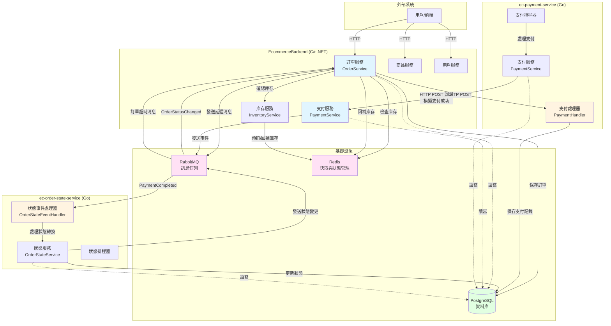
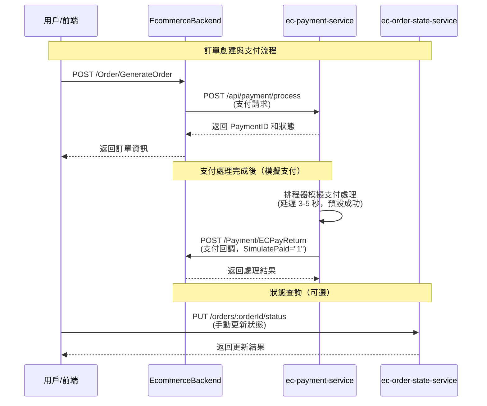
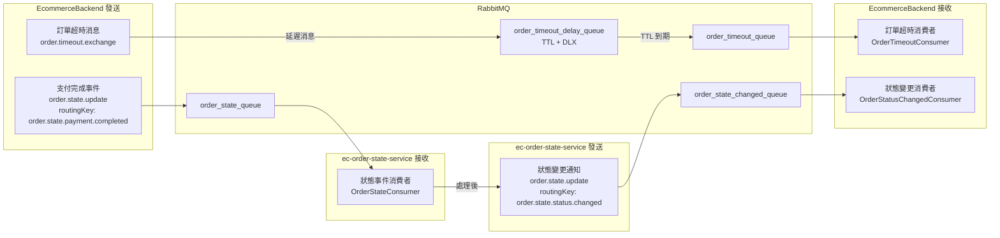
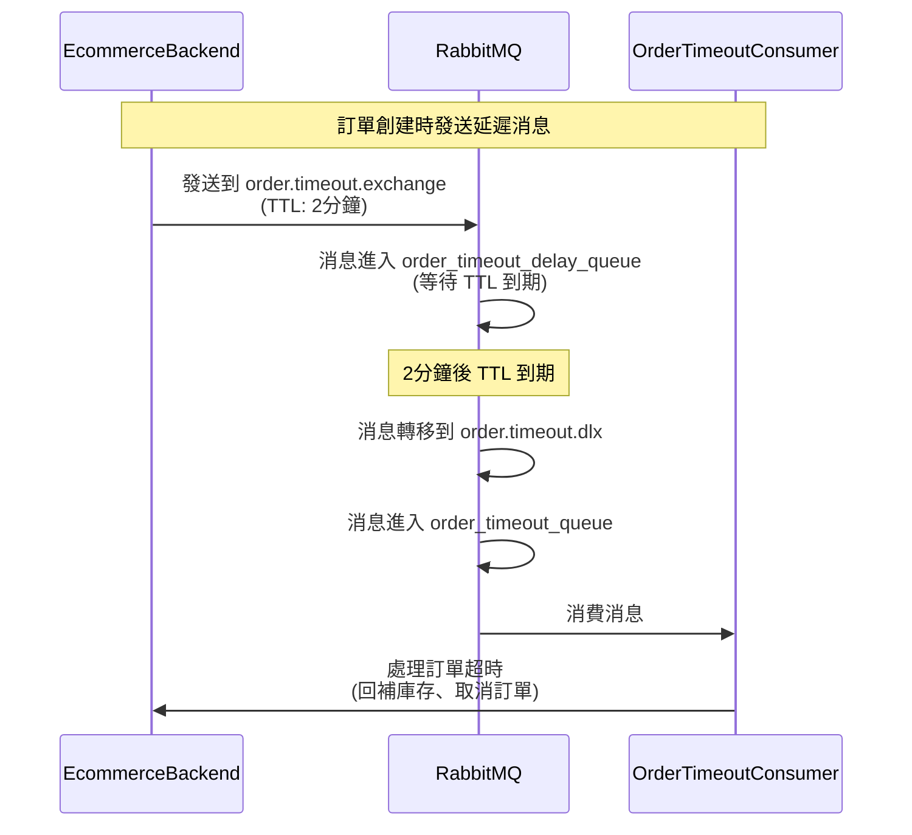
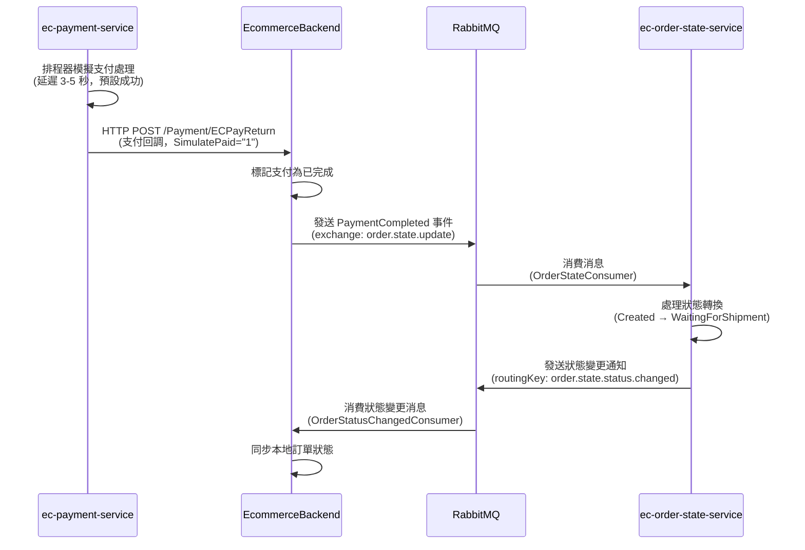
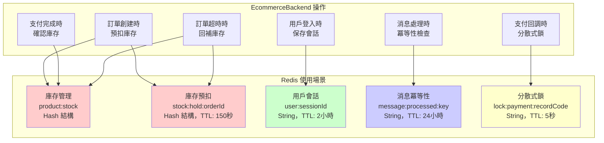
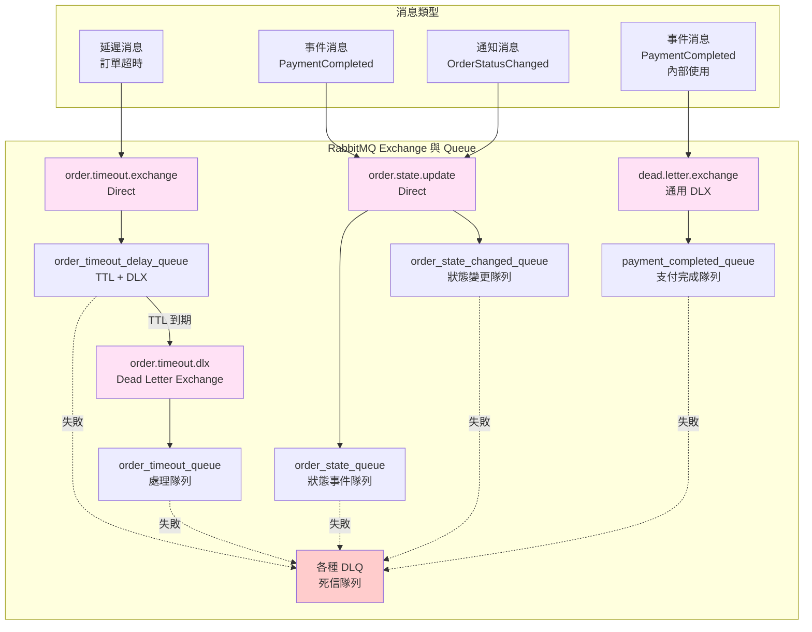
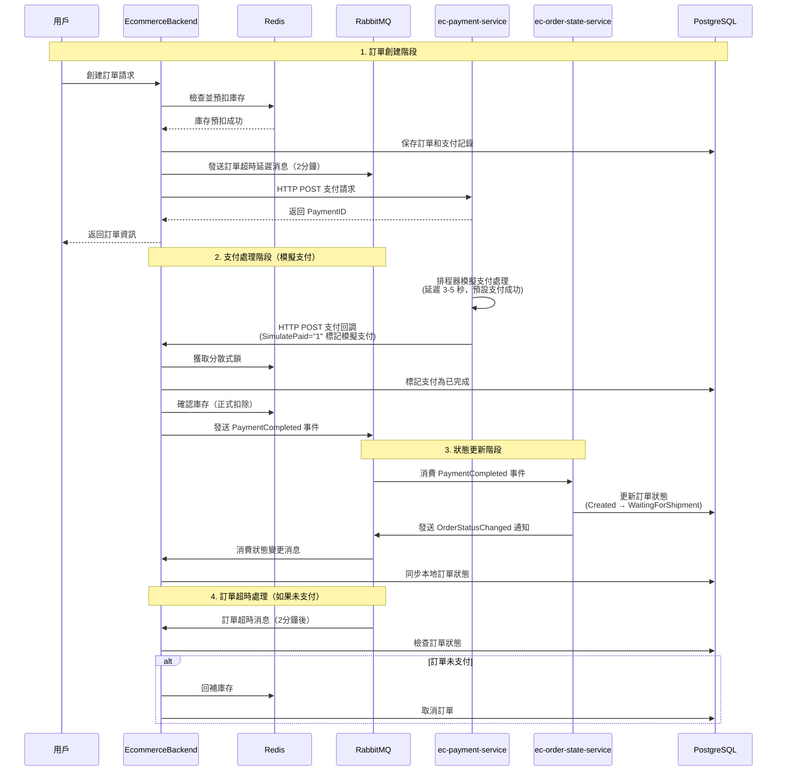

# 電商系統架構圖

本文檔使用 Mermaid 圖表展示電商系統中三個主要服務的架構關係、職責分工以及透過 HTTP 和 MQ 的交互方式。

## 系統概覽

本系統由三個主要服務組成：
1. **EcommerceBackend** (C# .NET) - 主後端服務
2. **ec-payment-service** (Go) - 支付服務（使用模擬支付，預設支付成功）
3. **ec-order-state-service** (Go) - 訂單狀態管理服務

> **注意**：本系統使用模擬支付機制，不涉及真實的第三方支付（如綠界支付）。支付處理會模擬 3-5 秒的延遲後預設標記為成功，用於開發和測試環境。

## 系統架構圖

## 服務職責說明

### EcommerceBackend (C# .NET)

**主要職責：**
- 📦 **訂單管理**：創建訂單、查詢訂單、訂單狀態同步
- 💰 **支付整合**：接收模擬支付回調、處理支付完成事件
- 📚 **商品管理**：商品資訊、商品變體管理
- 👤 **用戶管理**：用戶認證、會話管理
- 📊 **庫存管理**：透過 Redis 進行庫存預扣、回補、確認

**關鍵功能：**
- 訂單創建時預扣庫存（Redis）
- 發送訂單超時延遲消息（RabbitMQ TTL + DLX）
- 處理支付完成事件並發送狀態更新消息
- 接收訂單狀態變更通知並同步本地狀態

### ec-payment-service (Go)

**主要職責：**
- 💳 **支付處理**：接收支付請求、模擬支付處理邏輯
- 📝 **支付記錄**：保存支付記錄、查詢支付狀態
- 🔄 **支付回調**：處理支付完成後的回調通知

**關鍵功能：**
- 接收來自 EcommerceBackend 的支付請求（HTTP POST `/api/payment/process`）
- 保存支付記錄到資料庫
- 透過排程器模擬支付處理（延遲 3-5 秒，預設支付成功）
- 支付完成後透過 HTTP POST 回調 EcommerceBackend（SimulatePaid = "1" 標記為模擬支付）

**模擬支付說明：**
- 系統使用模擬支付而非真實的第三方支付（如綠界支付）
- 支付處理器會模擬支付延遲（3-5 秒隨機），然後預設標記為支付成功
- 回調資料中的 `SimulatePaid = "1"` 表示這是模擬支付，不會產生實際的資金流動
- 端點名稱 `/Payment/ECPayReturn` 為歷史遺留命名，實際功能為接收模擬支付回調

### ec-order-state-service (Go)

**主要職責：**
- 🔄 **狀態管理**：訂單狀態機管理、狀態轉換驗證
- 📋 **狀態追蹤**：訂單步驟記錄、狀態歷史
- ⚡ **事件處理**：處理支付完成等事件並更新狀態
- 🕐 **自動推進**：透過排程器自動推進訂單狀態

**關鍵功能：**
- 接收 PaymentCompleted 事件（RabbitMQ）
- 驗證狀態轉換合法性（狀態機）
- 更新訂單狀態並記錄步驟
- 發送狀態變更通知回 EcommerceBackend
- 提供 HTTP API 進行手動狀態更新（`PUT /orders/:orderId/status`）

## 交互方式詳解

### HTTP 交互

### RabbitMQ 消息交互

### 消息流程詳解

#### 1. 訂單超時消息流程

#### 2. 支付完成事件流程

## Redis 職責說明

**Redis 主要用途：**

1. **庫存管理** (`product:stock`)
   - 使用 Hash 結構存儲商品變體庫存
   - 支援原子性操作（HINCRBY）
   - 訂單創建時預扣，支付完成時確認，超時時回補

2. **庫存預扣記錄** (`stock:hold:orderId`)
   - 記錄每個訂單預扣的庫存數量
   - 設定 TTL（150秒）自動過期
   - 用於訂單超時時回補庫存

3. **用戶會話管理** (`user:sessionId`)
   - 存儲用戶登入資訊
   - TTL 設定為 2 小時
   - 用於認證和授權

4. **消息冪等性檢查** (`message:processed:key`)
   - 防止重複處理相同的消息
   - TTL 設定為 24 小時
   - 用於 RabbitMQ 消息消費的冪等性保證

5. **分散式鎖** (`lock:payment:recordCode`)
   - 防止同一訂單的支付回調被重複處理
   - TTL 設定為 5 秒
   - 使用 SET NX EX 實現

## RabbitMQ 職責說明

**RabbitMQ 主要用途：**

1. **異步消息傳遞**
   - 解耦服務之間的直接依賴
   - 提高系統的可擴展性和可靠性

2. **延遲消息處理**
   - 使用 TTL + DLX 實現訂單超時檢查
   - 訂單創建 2 分鐘後自動檢查支付狀態

3. **事件驅動架構**
   - PaymentCompleted 事件觸發訂單狀態更新
   - OrderStatusChanged 通知同步狀態變更

4. **消息可靠性保證**
   - 使用 DLQ（Dead Letter Queue）處理失敗消息
   - 支援消息重試機制
   - 確保消息不丟失

5. **負載均衡**
   - 多個消費者可以並行處理消息
   - 使用 Prefetch 控制消息分發

## 完整訂單生命週期流程

## 技術棧總結

| 服務 | 技術棧 | 主要職責 |
|------|--------|----------|
| **EcommerceBackend** | C# .NET, Entity Framework Core | 訂單管理、商品管理、用戶管理、庫存管理 |
| **ec-payment-service** | Go, Gin, PostgreSQL | 支付處理、支付記錄管理 |
| **ec-order-state-service** | Go, Gin, PostgreSQL | 訂單狀態管理、狀態機驗證 |
| **RabbitMQ** | AMQP 0.9.1 | 異步消息傳遞、延遲消息、事件驅動 |
| **Redis** | StackExchange.Redis | 庫存管理、會話管理、分散式鎖、冪等性 |
| **PostgreSQL** | Entity Framework Core / pgx | 資料持久化 |

## 關鍵設計模式

1. **事件驅動架構 (EDA)**
   - 使用 RabbitMQ 實現服務間的事件通信
   - 解耦服務依賴，提高系統彈性

2. **狀態機模式**
   - ec-order-state-service 實現訂單狀態機
   - 確保狀態轉換的合法性和一致性

3. **分散式鎖模式**
   - 使用 Redis 實現分散式鎖
   - 防止支付回調重複處理

4. **冪等性保證**
   - 使用 Redis 記錄已處理的消息
   - 確保消息處理的冪等性

5. **延遲消息模式**
   - 使用 RabbitMQ TTL + DLX 實現延遲消息
   - 用於訂單超時檢查

6. **庫存預扣模式**
   - 使用 Redis 原子操作預扣庫存
   - 支付完成後確認，超時後回補

